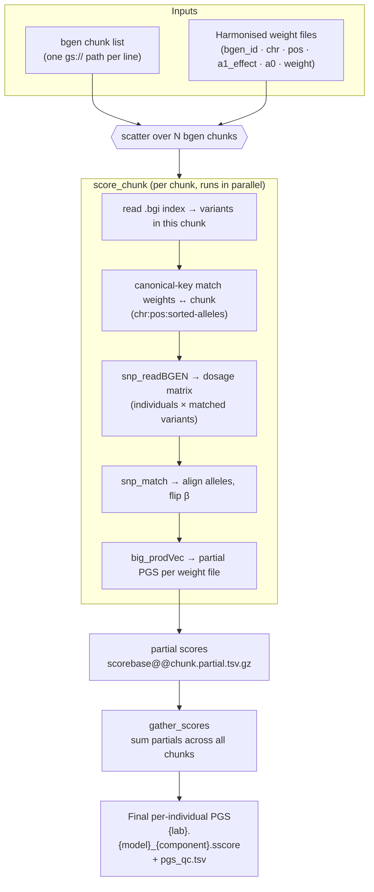
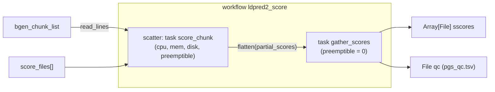

# FinnGen_LDpred-2 — `ldpred2_score`

A WDL pipeline that computes **per-individual polygenic scores (PGS)** by applying
**precomputed per-SNP weights** to imputed `bgen` genotypes, using the
[**bigsnpr**](https://privefl.github.io/bigsnpr/) / LDpred2 toolchain purely as a
**scoring engine**.

> **Scope — this is score-only.** The pipeline does **not** run LDpred2 inference and uses **no LD
> reference matrix**. It assumes the weights (betas) are already inferred (e.g. by LDpred2-auto, LDAK
> MegaPRS, PRS-CS, …) and simply evaluates the genotype × weight dot product
> `PGS_i = Σ_j dosage_ij · β_j` for every individual, distributed over `bgen` chunks.

It was built to score a set of partitioned longitudinal-lab weight files (LDAK MegaPRS `Intercept /
Slope / Resid / meanLabVal` components) against FinnGen R13 imputed genotypes, but it is generic: any
set of harmonised weight files and any chunked `bgen` release will work.

---

## How it works

For each `bgen` chunk (a scatter shard), `score_chunk` reads only the variants that overlap the
weight files, aligns alleles, computes a **partial** PGS per weight file, and writes one gzipped
partial. `gather_scores` then **sums the partials across all chunks** into one `.sscore` per weight
file. Because scoring is additive over disjoint variant sets, the sum of per-chunk partials equals the
genome-wide score.



### WDL structure



---

## Inputs

Edit [`wdl/ldpred2_score.inputs.json`](wdl/ldpred2_score.inputs.json):

| Input | Description |
|---|---|
| `ldpred2_score.docker` | The scoring image (built from `docker/`). |
| `ldpred2_score.bgen_chunk_list` | A text file with **one `gs://…bgen` path per line**. Each chunk must have sibling `.bgen.bgi` and `.bgen.sample` files (localized automatically). |
| `ldpred2_score.score_files` | Array of **harmonised weight files** (see format below), one per PGS to compute. |

### Harmonised weight-file format

Tab-separated, one row per SNP, with a header. One file per PGS.

```
bgen_id          chr   pos      a1_effect   a0   weight
1_785910_G_C     1     785910   C           G    1.8585e-04
```

| Column | Meaning |
|---|---|
| `bgen_id` | variant id (informational; matching is done on chr/pos/alleles) |
| `chr`, `pos` | chromosome (int or `chr`-prefixed) and base-pair position, on the **same build as the bgen** |
| `a1_effect` | effect allele (the `weight`/β is expressed w.r.t. this allele) |
| `a0` | other allele |
| `weight` | per-SNP weight / posterior effect (β) |

Producing these harmonised files (rsID → bgen coordinate/allele mapping) is an **upstream step**,
outside this repo.

## Outputs

- `sscores` — one `.sscore` per weight file, columns `FINNGENID` and `PGS` (the genome-wide score).
- `qc` — `pgs_qc.tsv`: per weight file, `n_individuals, mean, sd, n_chunks_summed`.

---

## Repository layout

```
FinnGen_LDpred-2/
├── wdl/
│   ├── ldpred2_score.wdl                # workflow: scatter score_chunk → gather_scores
│   ├── ldpred2_score.inputs.json        # inputs template (fill in your buckets/image)
│   └── cromwell_workflow_options.json   # labels + call-caching
├── scripts/
│   ├── score_chunk.R                    # per-chunk bigsnpr scoring
│   └── gather_scores.R                  # sum partials → final .sscore
├── docker/
│   ├── Dockerfile                       # R + bigsnpr + deps
│   └── cloudbuild.yaml                  # Cloud Build config
├── submit_ldpred2_score.sh              # example Cromwell submission helper
├── requirements.txt
└── LICENSE
```

---

## Usage

### 1. Build the image

No local Docker is required — build with Cloud Build (see [`docker/cloudbuild.yaml`](docker/cloudbuild.yaml)):

```bash
gcloud builds submit . \
  --config docker/cloudbuild.yaml \
  --substitutions=_TAG=0.1,_IMAGE=REGION-docker.pkg.dev/PROJECT/REGISTRY/ldpred2 \
  --project YOUR_GCP_PROJECT --region YOUR_REGION \
  --gcs-source-staging-dir gs://YOUR_STAGING_BUCKET/cloud_build_staging
```

> If your GCP org enforces `constraints/gcp.resourceLocations`, the `--gcs-source-staging-dir` flag
> (pointing at a bucket in an allowed region) is **required** — otherwise Cloud Build's default US
> staging bucket triggers `HTTPError 412: 'us' violates constraint`.

### 2. Configure inputs

Set the image tag, `bgen_chunk_list`, and `score_files` in `wdl/ldpred2_score.inputs.json`, and your
labels in `wdl/cromwell_workflow_options.json`.

### 3. Submit

```bash
./submit_ldpred2_score.sh          # thin wrapper around a Cromwell submit
```

Adapt the wrapper to your Cromwell submitter (Cromshell, REST API, Terra, or
[CromwellInteract](https://github.com/FINNGEN/CromwellInteract)).

### 4. Collect outputs

Retrieve the `.sscore` files from your Cromwell execution bucket once the workflow succeeds.

---

## ⚠️ Validation before trusting scores

This pipeline is numerically silent on a few points — validate them once for your genotype release
before using the scores downstream:

1. **Allele/dosage orientation (highest priority).** The score sign depends on which allele
   `snp_readBGEN` counts. The code assumes it returns the dosage of the **second** allele of each
   `<chr>_<pos>_<a1>_<a2>` id (the documented `bgen` behaviour) and orients `snp_match` accordingly. If
   your `bgen`/bigsnpr version counts the first allele, every PGS would be **sign-inverted with no
   error**. Confirm on ~50 individuals and one weight file against an independent scorer, e.g.
   `plink2 --bgen … ref-first --score <weights> …`, and check both **sign and magnitude** match.
2. **Non-autosomal chunks.** `chr_to_int` maps X/Y/XY/MT → 23–26, but bigsnpr's `format_snp_id` may
   reject non-1..22 codes. If your chunk list includes sex/MT chromosomes, test one such chunk (it
   would crash, not mis-score).
3. **Sample-id column.** The `FINNGENID` output is read from column 2 (`ID_2`) of the Oxford
   `.sample` file. Confirm that is your intended sample identifier.

The built-in guards that already prevent *silent* wrongness: `snp_match(strand_flip = FALSE)` keeps
ambiguous SNPs (harmonised data is same-strand); `gather_scores` **refuses to write** if any weight
file is missing chunks (would under-sum); and `score_chunk` aborts if two weight files share a
basename (would collide).

## Implementation notes & gotchas

These are the non-obvious pitfalls this pipeline explicitly handles — useful if you adapt it:

- **`bgen` variant-id / chromosome convention.** bigsnpr `snp_readBGEN` matches `list_snp_id` in the
  form `<chr>_<pos>_<a1>_<a2>` and its `format_snp_id()` requires a **numeric** chromosome. Some `bgen`
  indexes store `chr1` (string). `score_chunk.R` rewrites the localized `.bgi` `chromosome` column to a
  bare integer in place (only the text column; byte offsets untouched) and builds matching numeric
  ids. Variant matching itself uses an order-independent canonical key (`chr:pos:{sorted alleles}`) so
  it is robust to ref/alt ordering and `chr`-prefix differences.
- **Allele orientation.** `snp_match` reconciles effect-allele orientation and flips β for
  reversed/complementary alleles, so the score is not silently inverted; ambiguous (strand) SNPs are
  dropped.
- **Single-threaded BLAS.** bigstatsr aborts with *"Two levels of parallelism are used"* when
  `ncores > 1` runs on a multi-threaded BLAS. The workflow exports `OPENBLAS_NUM_THREADS=1` (etc.) and
  runs `--ncores 1`; per-chunk scoring is cheap, so this is not a bottleneck.
- **Compression.** The image's `data.table` is built without zlib, so partials are written plain and
  compressed with the `gzip` binary; `gather_scores` reads them via `gzip -dc`.
- **Dependencies.** `bigsnpr::snp_readBGEN` needs `dbplyr` at runtime — it is installed in the image.
- **`gather` is not preemptible.** It is a single reduce over all shards; `preemptible = 0` avoids
  losing it late.

---

## Requirements

See [`requirements.txt`](requirements.txt). Everything runs in the Docker image; the submitting host
only needs the Google Cloud SDK and a WDL runner.

## License

[MIT](LICENSE).
